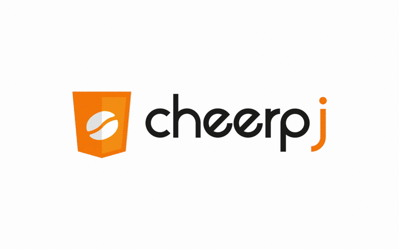

The CheerpJ Applet Runner is a browser extension/add-on that enables Java applets without requiring a local Java installation or to install deprecated plugins. CheerpJ Applet Runner is available as:

- Google Chrome Extension at <https://chrome.google.com/webstore/detail/cheerpj-applet-runner/bbmolahhldcbngedljfadjlognfaaein> 
- Microsoft Edge Add-On at <https://microsoftedge.microsoft.com/addons/detail/cheerpj-applet-runner/ebfcpaoldmijengghefpohddmfpndmic>

Note that both versions are upgraded to release of 2.2 of [CheerpJ](https://leaningtech.com/cheerpj/).

Since Java Applets have lost support on the majority of browsers, a tremendous amount of content, particularly in science and education, is virtually inaccessible. We aim at solving this problem by providing a solution to extend the life of Java applets on modern browsers.

What is the CheerpJ Applet Runner?
-------

The CheerpJ Applet Runner works by converting the Java Applet on the fly through CheerpJ, a minimal Java-bytecode-to-JavaScript compiler, directly on the browser, and linking it to the CheerpJ runtime environment.

Main project link: <https://leaningtech.com/cheerpj-applet-runner/>

Please note that CheerpJ Applet Runner extension is self packaged, meaning all needed assets will be downloaded at installation/update time. Usage of the CheerpJ Applet Runner will then only ever require users to download the actual applet content.

Using the CheerpJ Applet Runner
-------

Please feel free to try the extension on any applet you like. Here are a few examples:
* <http://sab-steveabaker.com/alpine/alpine.html>
* <http://sab-steveabaker.com/sabgolf/golf.html>
* <http://www.neilwallis.com/projects/java/water/index.php>
* <http://www.javaonthebrain.com/java/iceblox/>
* <http://www.schubart.net/rc/>

Bugs and Questions
-------
 
We welcome any feedback and bug report, either through the Extension/Add-On itself (click on icon + "Report bug") or on [GitHub](https://github.com/leaningtech/cheerpj-appletrunner/issues).
 
We aim at supporting as many Java applets as possible, and eventually Java WebStart applications.

More information
-------

You can find more information on the CheerpJ Applet Runner Extension in the [FAQs](https://docs.leaningtech.com/cheerpj-applet-runner/FAQs)
