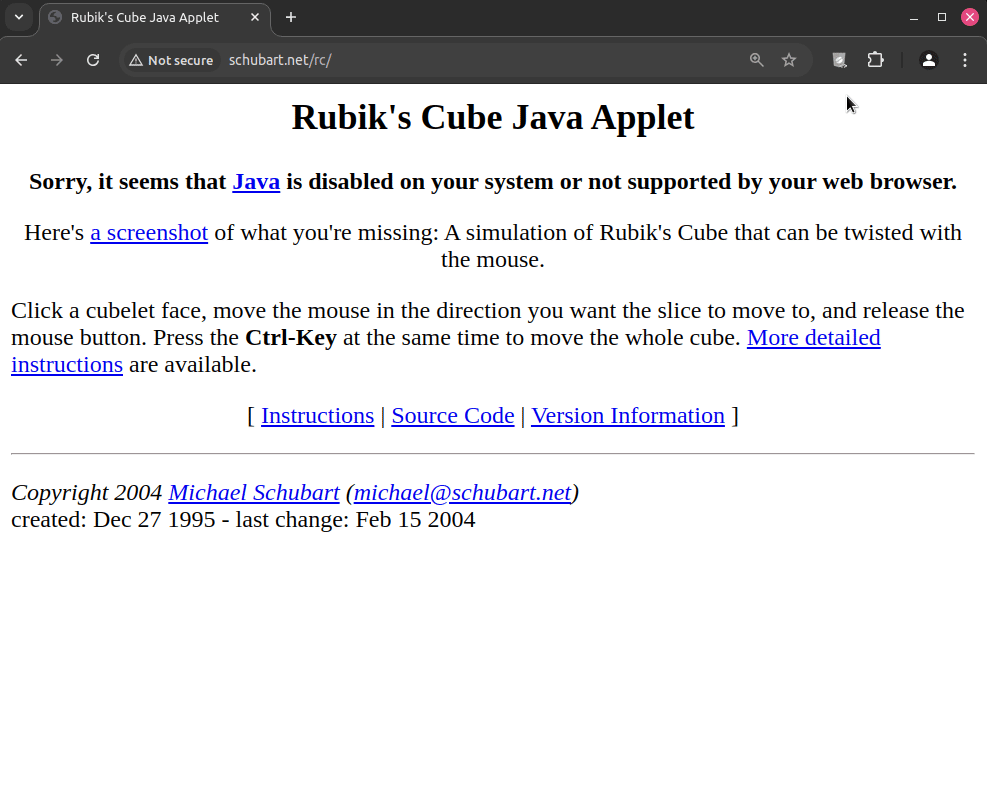

<h1></h1>

Run Java applets effortlessly on any website without the need for traditional Java plugins.

The CheerpJ Applet Runner browser extension, available for [Chrome](https://chrome.google.com/webstore/detail/cheerpj-applet-runner/bbmolahhldcbngedljfadjlognfaaein) and [Edge](https://microsoftedge.microsoft.com/addons/detail/cheerpj-applet-runner/ebfcpaoldmijengghefpohddmfpndmic), can run Java Applets without a local Java Desktop installation.

Since Java Applets have lost support on the majority of browsers, a tremendous amount of content, particularly in science and education, is virtually inaccessible. We aim at solving this problem by providing a solution to extend the life of Java applets on modern browsers.

## Features
CheerpJ Applet Runner is based on [CheerpJ](https://cheerpj.com), a JVM/JRE in WebAssembly and JavaScript for modern browsers. CheerpJ comes with a full OpenJDK runtime environment and replaces your JVM/JRE with a secure, browser-based alternative to run Java applications. 

CheerpJ supports a wide range of common application requirements, including:

- [Networking], including HTTP/S and TCP
- [Virtualized filesystem]
- [Clipboard] access
- Audio
- Printing
- Swing/AWT

## How to use the CheerpJ Applet Runner

The extension is designed to be simple and easy to use. Just install and pin the extension. Next navigate to your Applet-based website, click the extension icon in the upper-right corner of your browser, and then press the 'Enable' button in the popup. Once enabled, the extension is activated for the current domain, and Applets will start automatically if they are present.

## Privacy and Security

The extension is private and secure, runs fully client-side, and does not collect any data or analytics at all. All your data, as well as your application are kept within the boundaries of your browser. The privacy policy for the CheerpJ Applet Runner is available [here](https://cheerpj.com/privacy-policy-for-cheerpj-applet-runner-browser-extension/).

## Reporting bugs

If an Applet does not work as expected for you, we can help. Open an new [Issue](https://github.com/leaningtech/cheerpj-applet-runner/issues) providing the following information:

* A description of the problem
* Relevant screenshots
* The full console log, visible from Chrome's Developer Tools
* A publicly accessible URL, if possible

Please note that it might not be possible for us to help if the application is not accessible on the public internet. For internal and private applications, please get in touch privately at: appletrunner@leaningtech.com

[Networking]: https://cheerpj.com/docs/guides/Networking
[Virtualized filesystem]: https://cheerpj.com/docs/guides/File-System-support
[Clipboard]: https://cheerpj.com/docs/reference/cheerpjInit#clipboardmode
